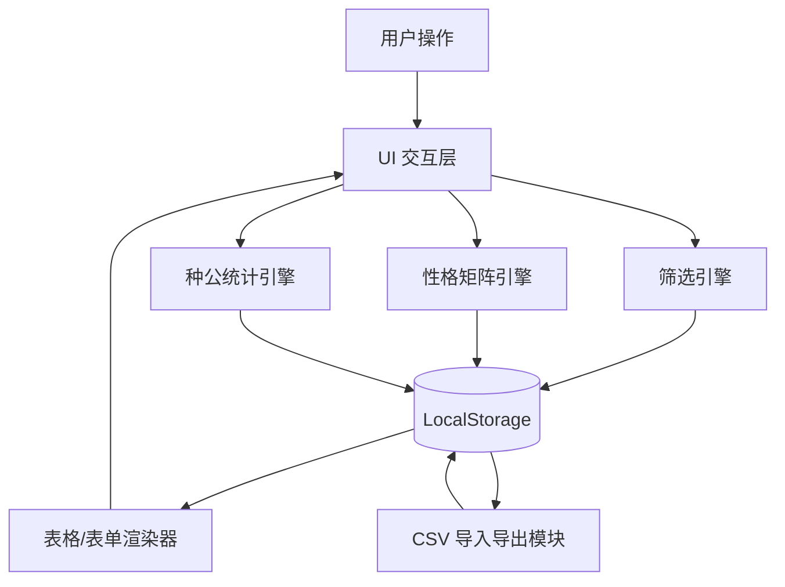

# 🎯 核心定位与边界

## ✅ In Scope

- 洛克王国精灵数据离线管理工具，支持精灵信息的增删改查与批量导入导出
- 基于 6x6 性格矩阵的可视化筛选与编辑（行=减益属性，列=增益属性，对角线无效）
- 雄性种公统计面板：按性格×蛋组交叉展示，仅显示非零个体值
- Excel 风格多维筛选浮层（性别/特长/奖牌/蛋组），支持 OR/AND 模式切换
- 双模数据持久化：LocalStorage 自动热保存 + CSV 手动导入导出（含冲突数量对比）
- 严格的数据校验：个体值仅允许 0 、7、8、9、10，血脉/性格/性别为必填
- 精灵名称输入自动联想：基于外部 JSON 数据源（430 条目），输入时实时下拉匹配，限制仅可选列表内名称
- 表单性格矩阵（单选模式）：在添加/编辑表单中内嵌小型 6×6 性格矩阵，点击即选，替代传统下拉框
- 个体值双模输入：拖动滑块（5 档位映射 0/7/8/9/10）+ 点击数值手动键入，回车确认后自动修正为最接近有效值
- 特长单选限制：每只精灵最多拥有一个特长，采用 radio button 互斥选择
- 所在盒子标签：每只精灵记录所在盒子名称（自由文本 + 已有盒子自动补全），支持筛选和 CSV 导入导出
- 批量选择与删除：表格行 checkbox 多选，支持全选筛选结果、批量删除、批量删除筛选结果
- 配种推荐引擎：选中一只精灵，自动匹配蛋组兼容的异性精灵，按"性格相同 + 个体值高位重叠数"排序分级（最优/次优/一般/基础）
- 种公统计增强：支持性格和蛋组下拉筛选，支持详细个体值/仅名称两种显示模式切换
- 数据源重构：基于精灵描述.json（1065 条）和蛋组描述.json 构建映射，按 species_id 去重为 444 个唯一精灵
- 属性/血脉拆分：属性（main_type/sub_type 合并）自动匹配只读，血脉手动输入可修改；支持 202 个双属性精灵
- CSV 编码自适应：UTF-8 优先，自动检测 GBK 编码文件并回退解码
- 种公统计性格矩阵筛选：6×6 矩阵多选替代下拉单选；蛋组标签勾选（AND 模式）替代下拉单选，始终展示全部 14 个可孵蛋组
- 表单布局优化：性格矩阵与 IV 滑块并排显示
- 精灵盒子整理侧边栏：2 列网格卡片展示盒子，支持批量移动、容量上限 30、新建/删除盒子、单步撤销/重做
- 种公统计蛋组列过滤：勾选蛋组控制列可见性（非精灵过滤），性格矩阵行过滤保持 OR 逻辑

## 🚫 Out of Scope

- 🚫 后端服务/数据库/用户认证：纯前端单页应用，零网络依赖，双击 HTML 即可运行
- 🚫 游戏战斗/养成/概率计算：仅做数据记录与筛选，不涉及游戏内机制
- 🚫 实时协同/云同步：数据完全本地化，通过 CSV 文件手动流转
- 🚫 外部 API 调用或动态资源加载：所有 CSS/JS/数据映射内联于单文件，禁止外链
- 🚫 精灵形态/异色/皮肤管理：仅记录基础名称与蛋组，括号后缀形态统一归一化处理

# 🏗 架构视图（抽象层）

## 模块/组件划分

- **数据层**: 精灵实体模型（名称、血脉、性格、性别、特长、奖牌、蛋组数组、个体值对象）、LocalStorage 读写器、CSV 解析/序列化器
- **UI 渲染层**: 主表格组件、输入表单网格、多维筛选面板、编辑/冲突/统计模态框、标签/进度/状态指示器
- **筛选引擎**: 多条件拦截器（精确匹配/范围过滤/枚举多选/矩阵 OR 逻辑）、AND/OR 模式控制器
- **性格矩阵引擎**: 6x6 网格渲染器、行/列批量选择逻辑、增益/减益映射表、UI 状态同步器
- **种公统计引擎**: 雄性数据过滤器、性格×蛋组交叉聚合器、非零个体值格式化器、列可见性控制器
- **盒子管理引擎**: 盒子自动收集器、容量检测器、批量移动执行器、撤销/重做栈

## 数据/控制流向

1. **初始化**: 读取 LocalStorage → 解析精灵数组 → 渲染主表格与筛选面板
2. **新增/编辑**: 表单输入 → 数据校验（个体值/必填项） → 对象构建 → 数组更新 → LocalStorage 同步 → 表格重绘
3. **筛选交互**: 用户点击浮层/矩阵/输入框 → 更新筛选状态机 → 触发过滤管道 → 渲染过滤后子集
4. **CSV 导入**: 选择文件 → 计数对比弹窗 → 用户确认 → 解析 CSV → 替换 LocalStorage → 刷新视图
5. **种公统计**: 点击按钮 → 弹窗打开 → 聚合雄性数据 → 按性格×蛋组生成网格 → 展示名称+非零个体值

## 依赖关系图（Mermaid）



# 📐 契约与规范（AI 生成依据）

## 接口/事件契约（结构化描述）

```yaml
精灵实体模型:
  id: string (时间戳+随机数，唯一标识)
  name: string (精灵主名称，去除括号后缀)
  type: string (血脉/属性，手动输入文本)
  nature: string (30种性格之一，来自性格矩阵)
  gender: enum ["雄性", "雌性"]
  specialty: array[string] (特长列表，可多选，选项见附录)
  medal: array[string] (奖牌列表，可多选，选项见附录)
  eggGroups: array[string] (蛋组列表，1-2项，来自外部JSON映射)
  ivs:
    hp: number (0或7-10)
    atk: number (0或7-10)
    spAtk: number (0或7-10)
    def: number (0或7-10)
    spDef: number (0或7-10)
    spd: number (0或7-10)
    box: string (所在盒子名称，自由文本，手动输入)

筛选状态契约:
  filterState:
    name: array[string] (多选，OR逻辑)
    type: string (精确匹配)
    nature: array[string] (矩阵选择，OR逻辑)
    gender: array[string] (多选，支持OR/AND切换)
    specialty: array[string] (多选，支持OR/AND切换)
    medal: array[string] (多选，支持OR/AND切换)
    eggGroup: array[string] (多选，支持OR/AND切换)
    box: array[string] (多选，支持OR/AND切换)
    ivRanges: object (6项，每项含min/max，默认0-10)

CSV 格式契约:
  编码: UTF-8 with BOM
  分隔符: 逗号
  表头: 名称,血脉,性格,性别,特长,奖牌,蛋组,生命,物攻,魔攻,物防,魔防,速度,盒子
  数组字段: 使用分号分隔 (例: 特长1;特长2)
  数字字段: 直接存储原始数字
```

## 前端/交互约定

- **布局结构**: 顶部工具栏（导入/导出/统计按钮） → 输入表单（网格布局） → 筛选面板（多列网格） → 数据表格（固定表头+横向滚动） → 底部操作列
- **性格矩阵交互**: 6行6列。行标题为减益属性（红色背景），列标题为增益属性（绿色背景）。点击行/列切换该行/列所有有效性格的选中状态。对角线显示斜杠不可选。选中态为蓝色高亮。筛选时默认 OR 逻辑。
- **Excel 风格筛选浮层**: 点击带图标字段触发。浮层含：标题栏+关闭按钮、复选框列表（显示具体名称+数量）、底部工具栏（OR/AND 切换复选框、清空按钮）。点击外部自动关闭。
- **表格显示规则**: 个体值 0 显示为 `-`，其他显示数字。性格影响列底色：增益属性列浅绿背景，减益属性列浅红背景，无影响列正常。蛋组显示为蓝色标签组。操作列含编辑（蓝）/删除（红）按钮。
- **模态框规范**: 编辑弹窗居中，遮罩层可点击关闭。冲突弹窗显示“本地缓存精灵数量”与“CSV文件精灵数量”，提供“覆盖本地”与“取消”按钮。种公统计弹窗为大窗口，内含性格×蛋组交叉表格。
- **反馈机制**: 表单提交前校验必填项与个体值范围，失败时阻塞并提示。LocalStorage 同步静默完成。CSV 导入成功显示加载数量提示。

# 📜 架构决策日志（ADRs）

[ADR-001] 单文件零依赖架构
时间：2026-05
背景：需离线使用，避免环境配置与服务器部署成本
选项对比：前后端分离（需服务器）、多文件前端（需HTTP服务）、单HTML内联（双击运行）
最终选择：单 HTML 文件，CSS/JS/数据映射全部内联
约束/代价：文件体积增大，但完全满足离线便携需求

[ADR-002] LocalStorage 自动保存 + CSV 手动备份
时间：2026-05
背景：需兼顾操作流畅性与数据安全流转
选项对比：仅缓存（丢失风险高）、仅文件（体验繁琐）、双模（自动热存+手动导出）
最终选择：LocalStorage 实时同步，CSV 作为备份/导入载体
约束/代价：需处理本地与文件冲突，冲突时展示数量对比供用户决策

[ADR-003] 性格矩阵可视化筛选
时间：2026-05
背景：30种性格基于属性加减关系，传统下拉无法直观表达且选择效率低
选项对比：长列表下拉（难记忆）、搜索框（无关联感）、6x6矩阵（直观映射属性，支持行列批量选择）
最终选择：行列标题着色，点击行/列批量切换，对角线拦截，筛选默认 OR
约束/代价：需维护固定映射表，但大幅提升筛选与编辑体验

[ADR-004] Excel 风格多维筛选浮层
时间：2026-05
背景：特长/奖牌/蛋组需多选且灵活切换逻辑，传统输入框无法胜任
选项对比：独立复选框组（占空间）、传统多选下拉（无逻辑切换）、Excel浮层（紧凑、熟悉、底部集成模式切换）
最终选择：点击字段弹出浮层，底部集成 OR/AND 切换与清空按钮
约束/代价：需管理浮层定位与焦点丢失关闭逻辑

[ADR-005] 蛋组数据外部化与精灵名称自动补全
时间：2026-06
背景：原有蛋组映射为手工维护的内联 JSON，仅覆盖约 200 种精灵，存在大量缺失与重复。用户提供了来自 Wiki 的结构化 JSON（430 条目），包含完整精灵名称与蛋组映射，且部分精灵有多个带括号后缀的形态变体
选项对比：保持旧 JSON 手工补全（维护成本高）、fetch 外部 JSON（破坏单文件架构）、精简提取 JSON 内联（兼顾完整性与架构约束）
最终选择：用构建脚本从源 JSON 提取 name→eggGroups 映射（8.5KB）和名称列表，内联到 HTML。名称输入改为受限自动补全——仅可选 430 个列表内名称，下拉显示蛋组提示，键盘上下选择+回车确认。提交时校验名称必须在列表中
约束/代价：需定期用构建脚本同步 JSON → HTML 数据；名称不在列表中的精灵无法录入

[ADR-006] 个体值双模输入（滑块+手动键入）
时间：2026-06
背景：原先使用 `<input type="number">` 存在 Backspace/Delete 键盘事件被拦截的 bug，且数字输入不够直观。用户要求保留滑块形式并增加手动键入能力
选项对比：仅滑块（直观但无法精确输入）、仅数字框（灵活但易输错）、滑块+点击数值编辑（兼顾两者）
最终选择：5 档位 range 滑块（映射 0/7/8/9/10），数值标签可点击——点击后切换为输入框，手动键入数字，回车/失焦时校验：有效值接受并同步滑块，无效值拒绝并提示错误、恢复原值。Esc 取消编辑
约束/代价：滑块线性刻度与实际值非线性映射（0→0, 1→7, 2→8, 3→9, 4→10），需额外的映射表维护

[ADR-007] 配种推荐引擎
时间：2026-06
背景：用户需要快速找到与目标精灵可配种的最优异性精灵。传统方式是手动对比蛋组和个体值，效率低且容易遗漏
选项对比：全排列列表展示（信息过载）、简单蛋组匹配（无排序）、多维排序推荐（精准但需定义优先级）
最终选择：以选中精灵为源，筛选蛋组有交集且性别相反的精灵，按以下优先级排序：

1. 性格相同 + 个体值非零位置重叠数 ≥4 → "最优"
2. 个体值非零位置重叠数 ≥2 → "次优"
3. 个体值非零位置重叠数 ≥1 或性格相同 → "一般"
4. 仅蛋组匹配 → "基础"
   结果以颜色标识分级，展示重叠位数和是否同性格
   约束/代价：仅考虑蛋组交集和性别相反两个硬条件，不考虑遗传技能、种族值等游戏内因素

[ADR-008] 批量选择与删除
时间：2026-06
背景：用户管理多只精灵时需要逐个删除，效率低。需支持批量勾选和基于筛选结果的批量操作
选项对比：仅全选（不够灵活）、行 checkbox + 固定批选栏（灵活但占空间）、行 checkbox + 动态批选栏（兼顾空间和功能）
最终选择：表头 checkbox 全选/取消 + 每行 checkbox 单选，有选中项时顶部动态显示批选栏（显示选中数量）。支持"全选筛选结果""选中筛选结果""取消选择""批量删除"四种操作。"删除筛选结果"直接清除当前筛选结果集
约束/代价：批量删除不可撤销，需 confirm 确认；不支持批量编辑（每次只编辑一只精灵）

[ADR-009] 数据源切换至精灵描述.json
时间：2026-06
背景：s2 JSON 仅含蛋组映射（430 条目），缺乏属性、种族值等扩展字段。用户提供了更完整的精灵描述.json（1065 条目，含 main_type/sub_type/breeding_profile 等）和蛋组描述.json（数字 ID→中文名映射）
选项对比：继续用 s2 JSON（数据有限）、只用精灵描述的蛋组部分（浪费）、构建综合 SPRITE_DATA（充分利用所有字段）
最终选择：从精灵描述.json 提取 form/localized.zh.name → 显示名，按 species_id 去重；breeding_profile.egg_groups 通过蛋组描述.json 映射为中文；main_type 和 sub_type 合并为 attribute 字段。构建 444 条综合映射内联到 HTML
约束/代价：精灵描述.json 体积较大（~4MB），需构建脚本提取精简数据后注入；数据更新时需同步运行提取脚本

[ADR-010] 属性与血脉字段拆分
时间：2026-06
背景：原有"血脉/属性"合一的 type 字段语义模糊——不同精灵的 type 值可能表示不同含义（如"光"是主属性，但"奇异""污染"是变异血脉）。需要拆分以明确语义
选项对比：保持合一（语义模糊）、拆为两个互斥字段（冗余）、拆分后属性只读/血脉可改（清晰且灵活）
最终选择：attribute（属性）自动从 main_type 合并 sub_type（双属性用"/"分隔），灰底只读不可修改；bloodline（血脉）默认留空，用户可手动输入任意值。CSV 导入时通过检测表头自动适配新旧格式
约束/代价：旧 CSV 导入时属性列缺失需自动留空；旧 LocalStorage 数据需迁移 type→bloodline

[ADR-011] CSV 编码自适应
时间：2026-06
背景：用户提供的 CSV 测试样本为 GBK 编码（无 BOM），之前的 UTF-8 硬编码导致中文乱码
选项对比：要求用户统一转 UTF-8（增加操作步骤）、手动选择编码（体验差）、自动检测（透明无感）
最终选择：使用 readAsArrayBuffer 读取原始字节，先尝试 UTF-8 解码，若解码后不含"名称"等中文字段名则自动回退 GBK 解码。无需用户手动选择编码
约束/代价：依赖 TextDecoder API（Chrome/Edge/Firefox 均支持 GBK 标签）

[ADR-012] 种公统计性格矩阵筛选
时间：2026-06
背景：种公统计原有性格和蛋组下拉单选筛选，无法同时查看多个性格/蛋组组合；需与主筛选面板保持一致的多选交互
选项对比：复用主筛选矩阵（尺寸偏大）、独立小型矩阵（适合弹窗空间）
最终选择：在统计弹窗内渲染独立 6×6 性格矩阵（单元格 40px，与主矩阵共享 NATURE_MATRIX 常量），多选 OR 逻辑，支持行列批量切换。蛋组改为标签 checkbox 组，始终显示全部 14 个可孵蛋组（不受当前数据有无影响），采用 AND 逻辑
约束/代价：需维护两套矩阵渲染逻辑（筛选面板 + 统计弹窗），但共享同一数据常量

[ADR-013] 盒子整理侧边栏
时间：2026-06-09
背景：用户需要在表格中勾选精灵后批量移动到指定盒子，每次手动输入 box 字段效率低。需要可视化的盒子管理界面
选项对比：弹窗 overlay（遮挡表格，勾选需反复开关）、侧边栏 flex 并排（表格和盒子同时可见可操作）
最终选择：点击"整理精灵"→ 右侧展开 380px 侧边栏，与表格 flex 并排。2 列网格展示盒子卡片（名称 + 容量 X/30），点击选中目标盒子后点击"移动"执行批量转移。支持新建/删除盒子、单步撤销/重做
约束/代价：侧边栏展开时表格区域缩小，需确保 checkbox 和关键列仍可见；撤销栈仅保留最近一次操作

[ADR-014] 种公统计蛋组列过滤
时间：2026-06-09
背景：种公统计蛋组筛选原本用于过滤精灵数据（只显示匹配蛋组的精灵），用户期望的是列可见性控制（勾选蛋组 A 时只显示 A 列，隐藏其他蛋组列）
选项对比：精灵过滤（改变数据显示）、列过滤（改变列可见性）
最终选择：蛋组筛选改为列可见性控制。勾选时 `el`（显示的蛋组列）直接使用筛选列表，不勾选时从数据中动态收集。字符矩阵负责行过滤（精灵），蛋组标签负责列过滤（可见性），两者正交
约束/代价：需正确处理"无法孵蛋"始终排除在列外；空列显示为 "-"

# ⚠️ AI 开发约束清单（生成前必读）

## ✅ 必须遵守

- ✅ 单文件架构：所有样式、脚本、数据映射必须内联于单一 HTML 文件，禁止外链或 `<script src>`
- ✅ 零外部依赖：不使用任何npm包、CDN库或框架
- ✅ 浏览器兼容性：支持现代浏览器（Chrome/Edge/Firefox最新2版本）
- ✅ 数据校验铁律：个体值输入框严格限制为 0 、7、8、9、10，提交时二次校验。血脉、性格、性别为必填
- ✅ LocalStorage键名：使用固定键名（'rocom_sprites'和'rocom_last_modified'）
- ✅ 性格矩阵映射：必须严格遵循 6x6 结构，行=减益(生命/物攻/魔攻/物防/魔防/速度)，列=增益，对角线为无效斜杠
- ✅ 数据来源：必须使用精灵描述.json（1065 条目）和蛋组描述.json（15 组映射）提取综合 SPRITE_DATA，不可手动维护内联数据
- ✅ 名称输入校验：提交时必须验证名称在 NAME_LIST 中，不在列表中的精灵名称拒绝录入
- ✅ 特长单选：表单和编辑弹窗中特长必须为 radio button 互斥选择，每只精灵最多一个特长
- ✅ 个体值输入：滑块仅允许 5 档位（映射 0/7/8/9/10），手动键入后自动修正为最接近有效值
- ✅ 盒子字段：表头包含"盒子"列，CSV 导出包含盒子字段
- ✅ 筛选逻辑默认值：所有筛选条件默认 AND 连接，但性格矩阵、性别、特长、奖牌、蛋组浮层必须提供 OR/AND 切换开关
- ✅ 显示格式化：个体值 0 在表格中必须渲染为 `-`。性格影响列需根据当前选中性格动态渲染浅绿(增益)/浅红(减益)底色
- ✅ CSV 编码规范：导出必须带 UTF-8 BOM，数组字段用分号分隔，确保 Excel 直接打开不乱码
- ✅ 冲突处理流程：导入时若 LocalStorage 非空，必须弹出对比弹窗，仅显示双方精灵数量，由用户点击确认覆盖
- ✅ 种公统计规则：仅筛选性别为“雄性”的精灵。按“性格×蛋组”生成网格。单元格内显示精灵名称换行+非零个体值列表。排除“无法孵蛋”蛋组

## 🚫 严格禁止

- 🚫 禁止引入任何第三方库（jQuery/Vue/React/Bootstrap等）或 CDN 资源
- 🚫 禁止使用 `eval()`、`Function()` 或动态脚本注入
- 🚫 禁止手动编辑内联的精灵名称列表或蛋组映射——必须通过构建脚本从 `rocom_egg_groups.json` 提取生成
- 🚫 禁止将特长输入改回多选——v2 已确认为 radio button 单选设计
- 🚫 禁止修改性格矩阵的行列顺序或对角线逻辑，性格矩阵对角线为斜线，不可选择
- 🚫 禁止在筛选逻辑中跳过 OR/AND 模式检查，默认必须为 AND，多选字段必须支持切换
- 🚫 禁止在种公统计中显示个体值 0 或包含“无法孵蛋”的数据

## ⚠️ 特别注意

- ⚠️ 精灵名称归一化：数据源中同一 ID 存在多个带括号后缀的形态（如“鸭吉吉（蓬松的样子）”），提取时必须去除括号及之后内容，仅保留主名称
- ⚠️ 浮层关闭机制：点击文档其他区域必须关闭所有打开的筛选浮层与下拉列表，避免界面残留
- ⚠️ LocalStorage 键名固定：使用 `rocom_sprites_v4` 存储数据数组；v2.1 加载时自动迁移旧字段（type→bloodline，补全 attribute/box）
- ⚠️ 蛋组数据来源：依赖提供的 JSON 结构中的 `eggGroups` 数组与 `entries` 映射关系，共 15 个蛋组，筛选与统计时需完整覆盖
- ⚠️ 个体值0在表格中显示为"-"，但存储为数字0
- ⚠️ CSV导入时需处理键名空格问题（原始JSON键名带空格）
- ⚠️ 导入文件与LocalStorage冲突时需显示数量对比，由用户决定

# 🧭 扩展与接入指南

## 新增模块注册/发现机制

- 单文件架构无模块注册表。新增功能需直接在 HTML 结构中添加对应 DOM 节点，在 `<style>` 追加样式，在 `<script>` 底部追加逻辑绑定
- 数据模型扩展：在精灵对象 YAML 契约中新增字段 → 同步更新表单输入控件 → 同步更新表格表头与数据行渲染 → 同步更新 CSV 表头与序列化逻辑

## 新功能需遵循的契约扩展流程

1. 定义数据字段类型与默认值
2. 在筛选面板添加对应过滤条件（如需）
3. 实现 UI 渲染逻辑与交互事件绑定
4. 更新 CSV 导入导出映射
5. 校验 LocalStorage 兼容性（旧数据自动补全默认值）

## 扩展模块示例

表单扩展：在输入表单中添加对应输入控件
筛选扩展：在筛选面板中添加对应筛选条件
表格扩展：在表头和数据行中添加对应列
CSV扩展：在导入导出逻辑中处理新字段
LocalStorage：自动保存，无需特殊处理

## 测试/验证要求

- 单元测试：[需开发者补充]
- 集成测试：[需开发者补充]
- E2E 测试：[需开发者补充]
- 手动验证重点：
  * 性格矩阵行/列点击是否准确批量切换选中态？对角线是否拦截？
  * 筛选浮层 OR/AND 切换是否实时生效？点击外部是否自动关闭？
  * CSV 导入冲突弹窗是否准确显示双方数量？覆盖后 LocalStorage 是否同步更新？
  * **个体值 0 是否严格显示为 **`-`？范围外输入是否被拦截？
  * 种公统计是否排除雌性/无法孵蛋？Emoji 显示是否正确？性格行顺序是否为列优先？
  * 名称归一化是否生效？（测试带括号形态名称）
  * 刷新页面后数据是否完整保留？（LocalStorage 持久化验证）

## 文档/元数据同步要求

- 版本更新时更新 `version` 字段
- 架构或契约变更时追加 ADR 记录并更新对应章节
- 新增约束必须同步至 `AI 开发约束清单`
- 数据源结构变更需更新 `⚠️ 特别注意` 中的归一化与映射说明

# 🔄 维护与演进规则

## 更新触发条件

- 版本发布：功能稳定且通过手动验证后更新语义化版本
- 架构变更：修改存储策略或引入新抽象层时记录 ADR
- 数据源更新：官方 JSON 结构变更时，同步更新解析逻辑与常量数组
- 规则调整：个体值范围或性格映射变更时，强制更新校验层与矩阵引擎

## 校验机制

- CI 检查：[需开发者补充]
- 人工 Review 要点：

  - 单文件结构完整性（无外链/无碎片）
  - LocalStorage 键名与冲突处理流程一致性
  - 性格矩阵交互与底色渲染准确性
  - 筛选逻辑 OR/AND 切换无状态残留
  - CSV 导出格式符合 Excel 兼容标准
  - 

  ## 非功能性要求

  | **类别**     | **要求**                                                                                        |
  | ------------------ | ----------------------------------------------------------------------------------------------------- |
  | **架构约束** | **单HTML文件，CSS/JS/数据映射100%内联。禁止** `<script src>`、禁止 `eval()`、禁止第三方库。 |
  | **数据校验** | **个体值输入框** `type="number" min="0" max="10"`，提交前二次校验数组 `[0,7,8,9,10]`。      |
  | **兼容性**   | **支持现代浏览器（Chrome/Edge/Firefox 最新2个稳定版）。不兼容IE。**                             |
  | **性能**     | **本地数据量 ≤ 5000 条时，筛选/渲染响应时间 < 200ms。矩阵点击无卡顿。**                        |

  ---

## 版本同步要求

- 无外部包管理文件，版本标识仅存在于 YAML 前端与 HTML 注释中
- 重大变更需在 ADR 中记录原因与替代方案
- 向后兼容原则：CSV 导入需兼容旧版字段缺失情况（自动填充默认值）
- 数据迁移：若底层结构变更，需提供一键转换脚本或兼容层逻辑

## 附录：性格列表（30个）

- |       | +生命 | +物攻 | +魔攻 | +物防 | +魔防 | +速度 |
  | ----- | ----- | ----- | ----- | ----- | ----- | ----- |
  | -生命 | ╲    | 逞强  | 理性  | 坦率  | 焦虑  | 热情  |
  | -物攻 | 沉默  | ╲    | 聪明  | 稳重  | 警惕  | 胆小  |
  | -魔攻 | 平和  | 固执  | ╲    | 天真  | 害羞  | 开朗  |
  | -物防 | 忧郁  | 大胆  | 专注  | ╲    | 温顺  | 急躁  |
  | -魔防 | 粗心  | 调皮  | 偏执  | 懒散  | ╲    | 莽撞  |
  | -速度 | 踏实  | 勇敢  | 冷静  | 悠闲  | 慎重  | ╲    |

## 附录：性格影响映射

  "沉默": { sub: "物攻", add: "生命" },
  "平和": { sub: "魔攻", add: "生命" },
  "忧郁": { sub: "物防", add: "生命" },
  "粗心": { sub: "魔防", add: "生命" },
  "踏实": { sub: "速度", add: "生命" },

  "逞强": { sub: "生命", add: "物攻" },
  "固执": { sub: "魔攻", add: "物攻" },
  "大胆": { sub: "物防", add: "物攻" },
  "调皮": { sub: "魔防", add: "物攻" },
  "勇敢": { sub: "速度", add: "物攻" },

  "理性": { sub: "生命", add: "魔攻" },
  "聪明": { sub: "物攻", add: "魔攻" },
  "专注": { sub: "物防", add: "魔攻" },
  "偏执": { sub: "魔防", add: "魔攻" },
  "冷静": { sub: "速度", add: "魔攻" },

  "坦率": { sub: "生命", add: "物防" },
  "稳重": { sub: "物攻", add: "物防" },
  "天真": { sub: "魔攻", add: "物防" },
  "懒散": { sub: "魔防", add: "物防" },
  "悠闲": { sub: "速度", add: "物防" },

  "焦虑": { sub: "生命", add: "魔防" },
  "警惕": { sub: "物攻", add: "魔防" },
  "害羞": { sub: "魔攻", add: "魔防" },
  "温顺": { sub: "物防", add: "魔防" },
  "慎重": { sub: "速度", add: "魔防" },

  "热情": { sub: "生命", add: "速度" },
  "胆小": { sub: "物攻", add: "速度" },
  "开朗": { sub: "魔攻", add: "速度" },
  "急躁": { sub: "物防", add: "速度" },
  "莽撞": { sub: "魔防", add: "速度" }

## 附录：奖牌列表（8个）

大块头、小不点、婉转声、粗嗓门、其他、无、炫彩、异色

---

# 🆕 v2.0 新增功能详细说明

## 1. 精灵名称自动联想（Autocomplete）

### 数据来源

- 源文件：`rocom_egg_groups.json`（430 条目，来自 Wiki 蛋组计算器页面）
- 构建流程：提取 `entries[].name` 为名称列表、`entries[].name → entries[].eggGroups` 为蛋组映射
- 存储方式：精简 JSON 内联到 HTML（~8.5KB）

### 交互行为

- **触发**：名称输入框获得焦点并输入文字后，实时过滤匹配列表
- **下拉列表**：最多显示 15 条匹配结果，每条附带蛋组预览（灰色小字）
- **键盘操作**：↑↓ 切换高亮项，Enter 确认选择，Esc 关闭列表
- **提交校验**：提交时检查名称是否在 NAME_LIST 中，不在则拒绝并提示
- **蛋组自动填充**：选中名称后自动查询蛋组映射并显示标签

### 名称归一化

- 数据源中存在带中文括号后缀的形态变体（如"鸭吉吉（蓬松的样子）"），存储时通过 `normalizeName()` 去除括号及之后内容，仅保留主名称
- 蛋组查询以归一化后的名称为键

## 2. 表单性格矩阵（单选模式）

### 与筛选矩阵的区别

| 特性       | 筛选矩阵           | 表单矩阵                          |
| ---------- | ------------------ | --------------------------------- |
| 选择模式   | 多选（OR 筛选）    | 单选                              |
| 单元格尺寸 | 64px 列宽          | 44px 列宽                         |
| 行/列标题  | 可点击批量切换     | 仅作标签展示                      |
| 位置       | 筛选面板（可折叠） | 添加表单 / 编辑弹窗               |
| 状态同步   | 触发筛选重渲染     | 存入 `STATE.formNature[prefix]` |

### 选中反馈

- 选中格：绿色高亮
- 下方文字：`已选: 胆小 (👟增益·⚔️减益)`
- 隐藏 input 同步更新，提交时读取

## 3. 个体值滑块 + 手动键入

### 滑块映射

```
滑块位置 0 → IV 值 0（灰色标签）
滑块位置 1 → IV 值 7（黄色标签）
滑块位置 2 → IV 值 8（蓝色标签）
滑块位置 3 → IV 值 9（紫色标签）
滑块位置 4 → IV 值 10（粉色标签）
```

### 手动键入流程

1. 点击数值标签（如 "8"）
2. 标签切换为输入框，自动 focus + 选中全部文字
3. 键入数字（仅允许数字键和 Backspace/Delete）
4. Enter 或失焦 → 校验输入值：有效（0/7/8/9/10）则接受并同步滑块，无效则提示错误并恢复原值
5. Esc → 放弃编辑，恢复原值
6. 滑块自动同步跳位

### 校验示例

- 输入 8 → ✅ 接受
- 输入 6 → ❌ 提示"输入值无效，仅允许 0、7、8、9、10"，恢复原值
- 输入 11 → ❌ 同上
- 输入 abc → ❌ 同上

## 4. 特长单选限制

- 控件类型从 checkbox 组改为 **radio button 组**（芯片样式，互斥选择）
- 每组 radio 共享同一 `name` 属性（`f_specialty` / `e_specialty`）
- 默认选中"无"
- 数据模型保持 `specialty: array[string]`，但数组长度始终为 0 或 1
- 筛选面板浮层仍支持多选（用户可能想同时查看有不同特长的精灵）

## 5. 所在盒子标签

### 数据模型

```
box: string  // 自由文本，空字符串表示未分配
```

### UI 呈现

- **表单**：文本输入框 + `<datalist>` 自动补全（从现有精灵中收集盒子名称）
- **表格**：青色标签（`.tag-box`），空则不显示
- **筛选**：📦 芯片 → 浮层多选（AND/OR 切换）
- **编辑弹窗**：文本输入框 + datalist

### CSV 兼容

- 导出表头新增"盒子"列（最后一列）
- 导入时读取第 14 列（index 13），空值记为 `""`

## 6. 批量选择与删除

### 选择机制

- 表头 checkbox：全选/取消当前筛选结果
- 行 checkbox：切换单行选中
- 批选栏按钮：
  - **全选筛选结果**：选中当前所有可见行
  - **选中筛选结果**：将当前筛选结果追加到已选集合
  - **取消选择**：清空所有选中
  - **批量删除**：confirm → 删除全部选中

### 状态管理

- `STATE.selectedIds`：`{ [id]: true }` 对象（比 Set 更兼容旧浏览器）
- 批选栏动态显示/隐藏（`batchBar` div）

### 约束

- 不支持批量编辑（每次只编辑一只精灵）
- 删除操作不可撤销

## 7. 配种推荐引擎

### 匹配条件

1. **硬条件**：性别不同 + 蛋组有交集
2. **排序维度**（依次）：
   - 个体值非零位置重叠数（0-6）↓
   - 性格是否相同 ↓

### 分级规则

```
性格相同 + 重叠 ≥4 项 → "最优" (best)  —— 绿色左边框
重叠 ≥2 项           → "次优" (good)  —— 紫色左边框
重叠 ≥1 或性格相同    → "一般" (ok)    —— 黄色左边框
仅蛋组匹配            → "基础" (low)   —— 灰色左边框
```

### UI

- 弹窗左侧：源精灵信息卡（名称、性别、性格、蛋组、非零 IV）
- 弹窗右侧：匹配列表，每项显示精灵名、性别、性格、蛋组、IV 摘要、评级徽章

## 8. 种公统计增强

### 新增筛选

- **性格下拉筛选**：动态填充当前数据中存在的雄性性格
- **蛋组下拉筛选**：动态填充当前数据中存在的蛋组（排除"无法孵蛋"）

### 显示模式切换

- **开关 ON（详细个体值）**：每个精灵名称下方显示非零 IV emoji+数值
- **开关 OFF（仅名称）**：只显示精灵名称，节省空间

### 视角切换

- 性格 × 蛋组（默认）：行=性格，列=蛋组
- 蛋组 × 性格：行=蛋组，列=性格

# 🔗 v2.0 新增文件说明

| 文件                        | 用途                                         |
| --------------------------- | -------------------------------------------- |
| `rocom_egg_groups.json`   | Wiki 蛋组计算器源数据（430 条目），定期更新  |
| `精灵盒子管理器0607.html` | 最新版管理器（v2.0），所有功能整合于此单文件 |

### 蛋组数据更新流程

1. 更新 `rocom_egg_groups.json`
2. 运行构建脚本提取 `EGG_GROUP_MAP` 和 `NAME_LIST`：
   ```js
   var data = JSON.parse(fs.readFileSync('rocom_egg_groups.json','utf-8').replace(/^/,''));
   var map = {}; data.entries.forEach(e => map[e.name] = e.eggGroups);
   var names = Object.keys(map);
   ```
3. 将输出注入 HTML 的 `<script>` 块中替换对应的 `var EGG_GROUP_MAP = ...` 和 `var NAME_LIST = ...`
